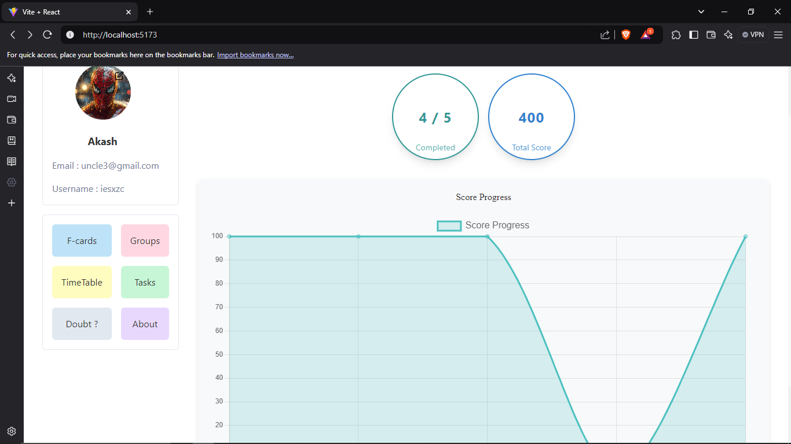

# Stew - Collaborative Study App

Stew is a powerful collaborative study application designed to enhance your learning experience through a wide range of interactive features. Whether you’re studying alone or with peers, Stew provides the tools you need to stay organized, connected, and engaged in your academic journey.

## Table of Contents

- [Features](#features)
- [Technologies Used](#technologies-used)
- [Screenshots](#screenshots)
- [Installation](#installation)
- [Usage](#usage)
- [Contributing](#contributing)
- [License](#license)

## Features

### Timetable Management
Create, edit, and customize your study timetable to effectively plan your study sessions. This feature allows you to:
- Allocate specific time slots for each subject or task.
- Adjust your timetable based on upcoming exams or deadlines.
- Set reminders for study sessions, helping you stay on track.

### Profile and Score Calculator
Track your academic progress with a personalized profile. This feature displays:
- Your scores across different subjects and assessments.
- Achievements earned through completed tasks and activities.
- Overall performance metrics, helping you identify strengths and areas for improvement.

### Data Visualization
Utilize interactive graphs to visualize your progress. This feature includes:
- Progress tracking charts that display your study habits over time.
- Visual representations of score improvements, enabling you to celebrate your successes.
- Insights into your study patterns, which can help refine your study strategies.

### Group Chat for Study
Collaborate with peers in real-time through our group chat feature. This allows you to:
- Share notes and resources seamlessly within study groups.
- Discuss difficult concepts and provide peer support.
- Create a sense of community and enhance collaborative learning.

### JWT-Based Authentication
Secure your account with JWT-based authentication. This ensures:
- Only authorized users have access to your personal data and features.
- A smooth login experience without compromising security.
- Protection against unauthorized access to sensitive information.

### AI Doubt Solving
Get instant assistance with your study-related queries using our integrated AI doubt-solving feature. This functionality allows you to:
- Ask questions and receive accurate answers quickly.
- Enhance your understanding of complex topics with AI-generated explanations.
- Use this feature as a supplementary tool alongside traditional studying methods.

### Flashcards
Create and review flashcards to reinforce your learning and improve retention of key concepts. This feature supports:
- Custom flashcard creation, allowing you to focus on areas where you need the most practice.
- Review sessions that help you memorize definitions, formulas, and important information.
- Categorization of flashcards for organized studying.

## Technologies Used

Stew leverages modern web technologies to provide a seamless user experience. Key technologies include:

- **Frontend**: Built with **React.js**, providing a responsive and interactive user interface.
- **Styling**: Enhanced user experience through **Chakra UI**, which offers a set of accessible and customizable components.
- **State Management**: Implemented using **React Context API** or **Redux** to manage global state across the application efficiently.
- **Authentication**: Utilizing **JWT (JSON Web Tokens)** for secure user authentication.

## Screenshots

Here are some screenshots of the Stew application that showcase its features:



*Home Screen: Your central hub for managing study activities and progress.*


## Installation

To get started with the Stew frontend, follow these steps:

1. **Clone the Repository**:
   Open your terminal and run the following command to clone the repository:
   ```bash
   git clone https://github.com/iesxz-c/Stew.git
   ```

2. **Navigate to the Frontend Directory**:
   Change your current working directory to the frontend folder:
   ```bash
   cd Stew/frontend
   ```

3. **Install the Dependencies**:
   Install the required packages using npm:
   ```bash
   npm install
   ```

4. **Start the Development Server**:
   Launch the application by running:
   ```bash
   npm run dev
   ```

5. **Open Your Browser**:
   Navigate to `http://localhost:3000` in your web browser to access the application.

## Usage

Once the app is running, you can begin exploring its features:

- **User Registration and Login**: Create an account or log in with your credentials. The authentication process ensures that your data remains secure.
  
- **Timetable Management**: Access the timetable feature to create and manage your study schedule. Set specific subjects and time slots, ensuring an organized study routine.

- **Profile Overview**: Check your profile to see your scores, achievements, and performance metrics, helping you stay motivated and focused on your goals.

- **Engage in Group Chats**: Join or create study groups to discuss topics, share resources, and provide support to each other.

- **Utilize AI Doubt Solving**: Whenever you have questions or need clarification, use the AI doubt-solving feature for quick and accurate responses.

- **Create Flashcards**: Use the flashcard feature to enhance your learning and retention. Customize your flashcards based on your study needs.

## Contributing

We welcome contributions to Stew! If you'd like to contribute, please follow these steps:

1. **Fork the Repository**: Click the "Fork" button in the top right corner of the repository page.
   
2. **Clone Your Fork**: Clone your forked repository to your local machine:
   ```bash
   git clone https://github.com/your-username/Stew.git
   ```

3. **Create a New Branch**: Always create a new branch for your feature or bug fix:
   ```bash
   git checkout -b feature-name
   ```

4. **Make Changes**: Implement your changes and commit them with a descriptive message:
   ```bash
   git commit -m "Description of the changes made"
   ```

5. **Push Changes**: Push your branch to your forked repository:
   ```bash
   git push origin feature-name
   ```

6. **Create a Pull Request**: Go to the original repository and click on the "Pull Requests" tab to submit your changes.

## Backend Link

The backend code for Stew is available on [GitHub here](https://github.com/iesxz-c/Stew-Sever).

## License

This project is licensed under the MIT License. See the [LICENSE](LICENSE) file for more information.

---

Thank you for checking out Stew! We hope it helps you achieve your academic goals. If you have any questions or feedback, feel free to reach out.